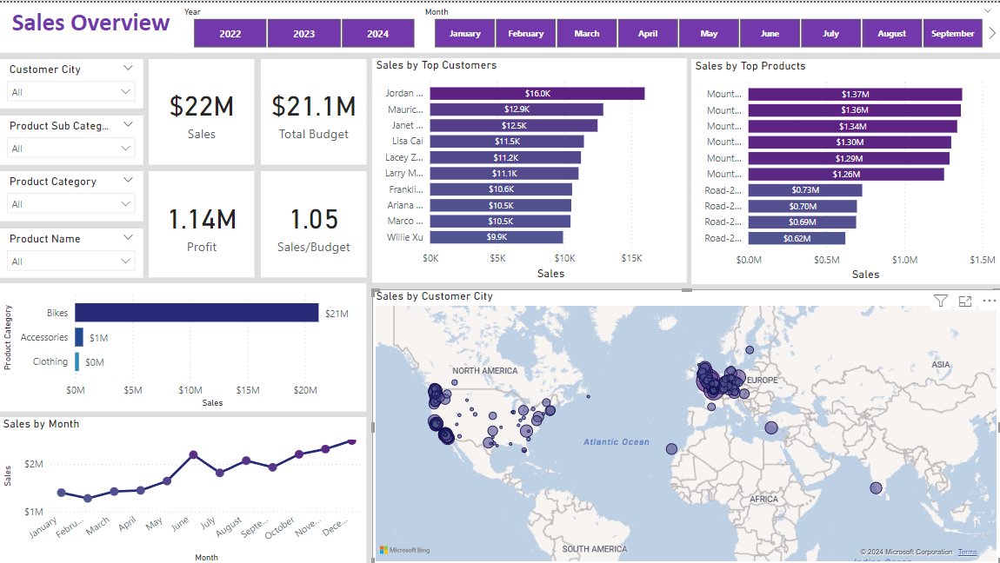
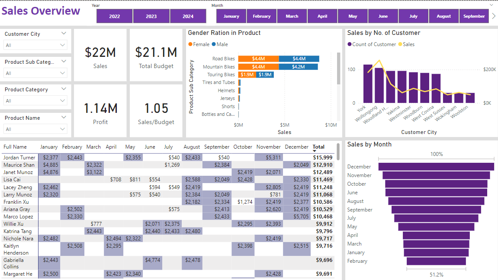

# Sales Overview Analysis

## Table of Contents
- [Project Overview](#Project-Overview)
- [Data Sources](#Data-Sources)
- [Tools](#Tools)
- [Procedure](#Procedure)
- [Finding](findings)

## Project Overview
This project aims to develop a comprehensive sales analysis dashboard using Power BI to provide insights into sales performance, identify trends, and support data-driven decision-making.
The dashboard will integrate and visualize data, and offer detailed analyses to help understand sales dynamics, customer behavior, and market conditions. 
In this project, I independently raised some questions and try to slove it by analysis and visually represented their answers.  
The questions are 

## Data Sources
The dataset we are using for this analysis microsoft AdventuresWorks datawarehouse backupfile ([Dataset](https://learn.microsoft.com/en-us/sql/samples/adventureworks-install-configure?view=sql-server-ver15&tabs=ssms)).
We download the backupfile form the site , after that we import that backup file as our database with the help of Microsoft SQL Server Managemnet Studio. When we look into our dataset we find too many tables that are either Dimension table or Fact table.

## Tools
* SQL: Data Retrieval, Querying
* Excel: Data Cleaning, Data manipulation
* DAX: Creating calculated columns and measures, Advanced Data Manipulation
* Powwer BI: Data visualization

## Procedure 
1. Import the dataset in SSMS and trying to understand it figure out which table we needed , what are the columns should we use to analysis.
2. Write the query to filter out the columns and data that we needed.
3. Export the results as excel file and store it for futher cleaning.
4. Open these Excel files for cleaning of data and perform necessary steps to make our data more productive
5. Now, we will import the Excel files into Power BI.
6. Next, we will check that all columns in the tables have the correct data types.
7. With the help of DAX, we will create necessary measures and perform all the required calculations.
8. Now, we will use this data as the dataset for our visuals.
9. Next, we will create a dashboard using different visualizations.
10. Using these visuals, we will answer our questions. 

## Question
1. Total Sales
2. Monthly Sales
3. Sales Overall the globe
4. Does we need to lunch any Gender centric Product
5. What is our sales in top cities
6. Which quater of the year have maximum sales

    
## Findings

* We have done total sales of $22 Millions

* From above visual we can clearly see that our product is bought by both male and female equally.
* The last quater of the year that is Oct - Dec have highest Sales
  

